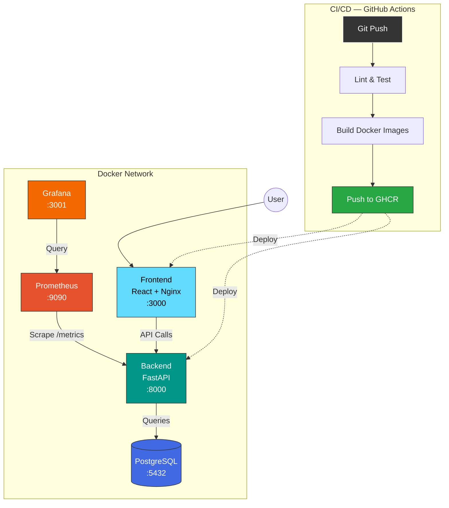

# FinOps — Personal Finance Tracker

> A fully containerized personal finance application with a complete DevOps pipeline — from code to production observability.

-------------------------------------------------------------------------------------

## Table of Contents

- [Overview](#overview)
- [Architecture](#architecture)
- [Tech Stack](#tech-stack)
- [Getting Started](#getting-started)
- [CI/CD Pipeline](#cicd-pipeline)
- [Monitoring](#monitoring)
- [Project Structure](#project-structure)
- [Contributing](#contributing)
- [License](#license)

---

## Overview

**FinOps** is a personal finance tracker that allows users to manage expenses and income. The goal of this project is not just the application itself, but to demonstrate a **complete DevOps lifecycle**:

- Containerized microservices (Docker)
- Automated CI/CD pipeline (GitHub Actions)
- Infrastructure as Code (Docker Compose)
- Automated testing (pytest + Jest)
- Observability stack (Prometheus + Grafana)
- Professional documentation

---

## Architecture

## Architecture

---

## Tech Stack

| Layer          | Technology        | Purpose                        |
|----------------|-------------------|--------------------------------|
| Frontend       | React + Nginx     | User interface & static serve  |
| Backend        | Python + FastAPI  | REST API                       |
| Database       | PostgreSQL        | Data persistence               |
| Containers     | Docker + Compose  | Service orchestration          |
| CI/CD          | GitHub Actions    | Automated pipeline             |
| Monitoring     | Prometheus        | Metrics collection             |
| Dashboards     | Grafana           | Metrics visualization          |
| Testing        | pytest + Jest     | Unit & integration tests       |